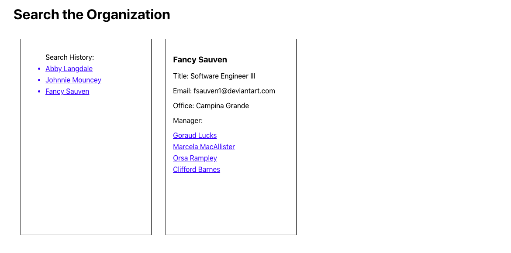

# Search the Organization

## MVP Features:
* View each person's information
* Search history list for easy navigation

## Future Iterations
* Optimize how state is used to track search hsitory
* "Back" and "Forward" navigation buttons for search history
* Improved search parameters
    * Search by City
    * Search by Title
* Style the site with color

## Technologies
* React JS
* [JSON server](https://github.com/typicode/json-server)
    * Creates a REST API from a JSON file

## Installation
1. Git clone this repository.
2. Open a terminal to run the server.
    * `npm start`
    * Visit `http://localhost:8000/company` to view the JSON response
3. Open a second terminal to run the client.
    * `cd client`
    * `npm start`
    * Visit `http://localhost:3000` to view the app